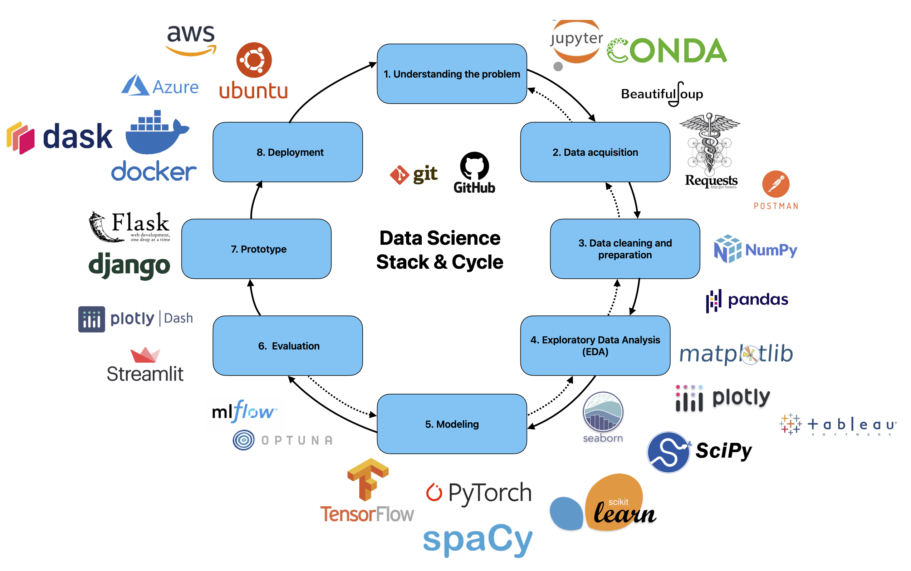

# Location Based Services Winter 2024-2025

- [Ex 1 - Dasbords and ML intro](https://www.youtube.com/watch?v=N7zd-zwX3Vc)
- [Ex 2 - EDA part 1](https://www.youtube.com/watch?v=XAOUxzIdOqE)
- [Ex 3 - EDA Part 2 and GeoPandas](https://www.youtube.com/watch?v=SQu12sD2MMc)
- [Ex 4 - Python Environment](https://docs.google.com/presentation/d/e/2PACX-1vS680l1nxBNaLTr9a3EtDb7mnR8FymSab2CLaPRoQLXHbaEBc3VYf_yE-uBSID2ltmrV0iMDdIuJLd_/pub?start=false&loop=false&delayms=3000)
- [Ex 4 - Git & GitHub](https://docs.google.com/presentation/d/e/2PACX-1vQgCcs51ClfksEj8qMdLwQjDZogEPCMLu6rLHBoc9oEKEzeg5sAX4i6qDvt091DV0WM6A1bJ36Ewstv/pub?start=false&loop=false&delayms=3000)
